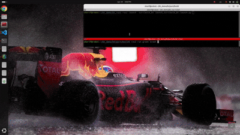
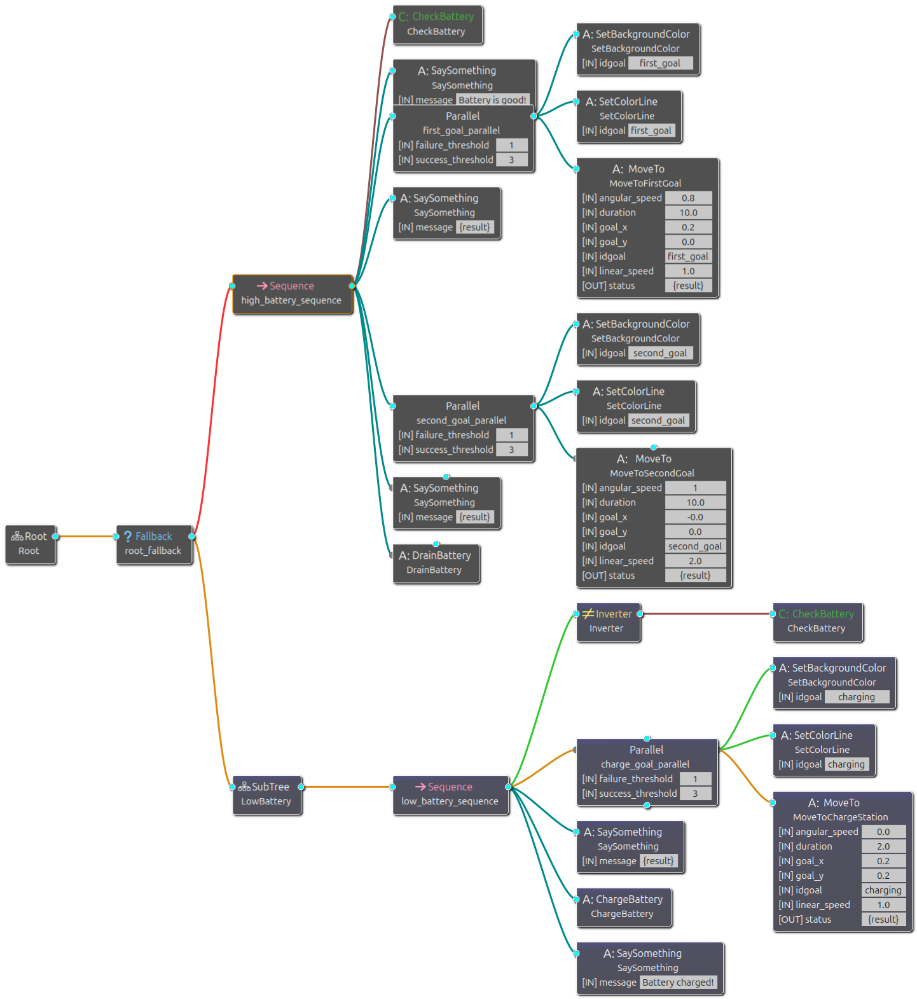
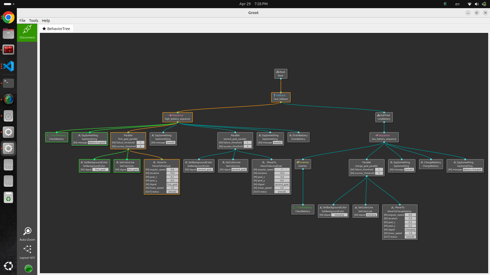
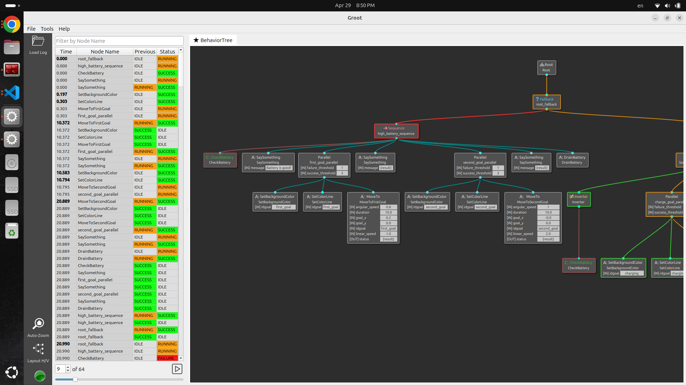

# ROS2 Behavior Tree for Turtlesim

This repository demonstrates a simple implementation of a Behavior Tree (BT) in ROS2, using a simulated turtle (`turtlesim`). The behavior tree controls the turtle's actions based on its battery level and the environment. The turtle moves toward a charging station if the battery is low, charges itself, and then moves toward a goal if the battery is sufficiently charged.

## Table of Contents
- [Demo](#-demo)
- [Overview](#overview)
- [Behavior Tree Architecture](#behavior-tree-architecture)
- [Setup](#setup)
- [Launch Instructions](#launch-instructions)
- [Behavior Trees and Groot](#behavior-trees-and-groot)

# 🎥 Demo


# Overview

This example integrates a Behavior Tree with a ROS 2 node (turtle_bt) to simulate decision-making behavior based on battery status. The turtle executes tasks by:

- **Checking battery level** and branching behavior accordingly.

- **Navigating to specified goals** with custom parameters (speed, orientation, and duration).

- **Providing visual cues** via dynamic **pen** and **background color changes** to indicate operational state.

- **Displaying status messages** to the console for easier debugging and state tracking.

This behavior is orchestrated using a Behavior Tree (defined in turtle_tree.xml), which is modular, readable, and easy to extend.


# Behavior Tree Architecture


The Behavior Tree is defined in XML and consists of two major paths:

### 1. High Battery Path
Executed when the battery level is **above 50%**:
- Say: "Battery is good!"
- Navigate to the **first goal**
  - Set pen color to **green**
  - Set background to **pink-purple**
- Say arrival message
- Navigate to the **second goal**
  - Set pen color to **purple**
  - Set background to **light blue**
- Say arrival message
- Drain the battery

### 2. Low Battery Path
Executed when the battery is **below 50%**:
- Move to the charging station
  - Set pen color to **gold**
  - Set background to **dark slate gray**
- Say: "Going to charge..."
- Charge the battery
- Say: "Battery charged!"

All logic is modular and defined via condition and action nodes in the XML.


---

# Setup

1. **Install ROS2**: This package was developed using ROS2. Make sure that you have ROS2 installed on your machine.

2. **Install Dependencies**:
   - `geometry_msgs`: Provides message types for motion commands.
   - `turtlesim`: Simulates a turtle in a 2D space.
   - [`behaviortree_cpp_v3`](https://github.com/BehaviorTree/BehaviorTree.CPP): Used for creating the behavior tree.
   - [`Groot`](https://github.com/BehaviorTree/Groot) : For visual editor and debugger for Behavior Trees

3. **Clone the Repository**:
   Clone this repository to your workspace and build the package.
   ```bash
   git clone https://github.com/sherif1152/Turtlesim_BT.git
   cd turtlesim_bt
   colcon build
   ```

4. **Source the Setup**:
   After building the package, source the workspace.
   ```bash
   source install/setup.bash
   ```
   ----


# Launch Instructions

Run the demo with the following command:
```bash
ros2 launch turtlesim_bt launch_turtlesim_bt.launch.py
```

You should see the turtle moving, changing pen and background colors, and reacting to battery state changes dynamically.


## Behavior Trees and Groot


#### What Are Behavior Trees?

**Behavior Trees** are a modern alternative to Finite State Machines (FSMs) used for decision-making in robotics and AI systems. They:

- Are modular and easier to debug

- Allow for fallback and sequential logic

- Separate **conditions** from **actions**

Behavior Trees are composed of control nodes (such as **Sequence**, **Fallback**) and leaf nodes (Conditions and Actions). In this project:

- CheckBattery is a condition node

- MoveTo, SetPen, SetBackground, Speak, and ChargeBattery are action nodes

- A **Sequence** node (→) executes its children from left to right and fails if any child fails.

- A **Fallback** node (?) attempts children in order and succeeds when the first child succeeds.

These provide clean and modular logic to build decision-making flows.

### Using Groot

#### What is Groot?
**Groot** is a graphical interface developed by the BehaviorTree.CPP authors to:

- Design Behavior Trees visually using XML

- Monitor BT execution in **real time**

- Replay logs from past BT runs for debugging and analysis

### 📡 Real-Time Monitoring in Groot

To visualize and debug the Behavior Tree in real time, Groot communicates with your application using **ZeroMQ (ZMQ)** over the local network.

#### 🛠️ How to Connect Groot
Make sure your BT application includes this line:

```cpp
BT::PublisherZMQ publisher(tree);
```

1. Run your ROS 2 BT application.

2. Open Groot and click on "`Monitor`" when prompted.

3. Groot will automatically connect to:
    - **`Server IP`** : **`localhost`** (or your machine's IP if connecting remotely)

    - **`Publisher Port`** : **`1666`** Live node status updates

    - **`Server Port`** : **`1667`** Behavior tree structure

You will see live updates with color-coded statuses:

- 🟩 Green: Success

- 🟨 Yellow: Running

- 🟥 Red: Failure



---------
### 📼 Log Replay in Groot

Groot includes a powerful **Log Replay** feature, which lets you visualize and analyze Behavior Tree executions **after they happen**, using saved logs.

#####  ✅ What You Can Do with Log Replay:
- Step through a previously executed Behavior Tree f**rame by frame**

- See the status of each node (Success, Failure, Running) **at each time step**

- Debug complex behaviors without rerunning the entire ROS 2 simulation

- Share logs with teammates for collaborative debugging or performance reviews

### 🛠 How to Use Log Replay
1. Generate a Log File
    In C++ code, make sure you log the BT execution using the `FileLogger`:

    ```cpp
    BT::FileLogger file_logger(tree, "bt_log.fbl");
    ```

    >💡 This generates a .fbl log file (e.g., bt_log.fbl) in your working directory.
    Ensure the path is writable and doesn't use hardcoded user-specific paths like /home/username.

2. Open Groot and click on "`Log Replay`" when prompted.

3. Load Your Log File

    - Select the .fbl file you previously recorded (e.g., bt_log.fbl).

    - Groot will load your behavior tree and the recorded execution timeline.

4. Replay and Analyze

    - Use the timeline controls (play, pause, step) to inspect the execution.

    - Watch each node change color over time (🟢 Success, 🔴 Failure, 🟡 Running).

    - Identify where things went wrong or verify that behaviors triggered as expected.



This integration makes it easy to iterate on logic design and monitor the runtime status of each node, including color-coded feedback and status updates.